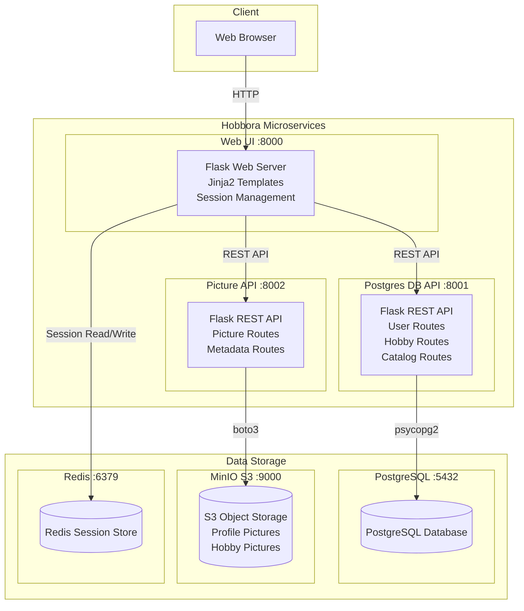
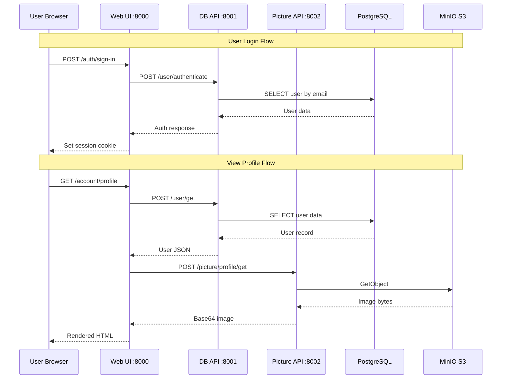
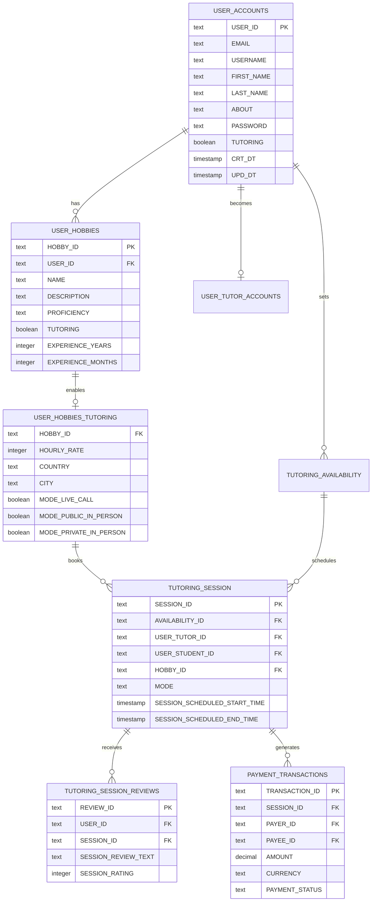
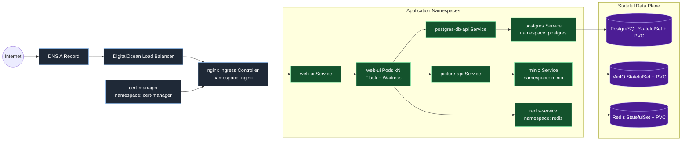

# Hobbora Architecture

## System Architecture Diagram

## Data Flow Diagram

## Database Schema

## Service Ports Summary

| Service | Port | Technology |
|---------|------|------------|
| Web UI | 8000 | Flask + Waitress |
| Postgres DB API | 8001 | Flask + Waitress |
| Picture API | 8002 | Flask + Waitress |
| PostgreSQL | 5432 | PostgreSQL 16.4 |
| Redis | 6379 | Redis 7.x |
| MinIO (S3) | 9000 | MinIO |
| MinIO Console | 9001 | MinIO Web UI |

## Technology Stack

| Layer | Technology |
|-------|------------|
| Frontend | HTML, CSS, Jinja2 Templates |
| Web Server | Flask + Waitress |
| Database | PostgreSQL 16.4 |
| Object Storage | MinIO (S3-compatible) |
| Authentication | bcrypt + Flask Sessions + Redis-backed server sessions |
| Containerization | Docker |
| Orchestration | Kubernetes |

## Kubernetes Infrastructure Interaction Chart

> This view is cluster-focused (ingress, namespaces, services, stateful components)
> and complements the app-level diagrams above.

### Why Redis is now in the path

- Browser stores only a `session_id` cookie.
- Each web-ui request can land on any pod.
- Pods fetch/write session state in Redis, so login/session persists across replicas.

